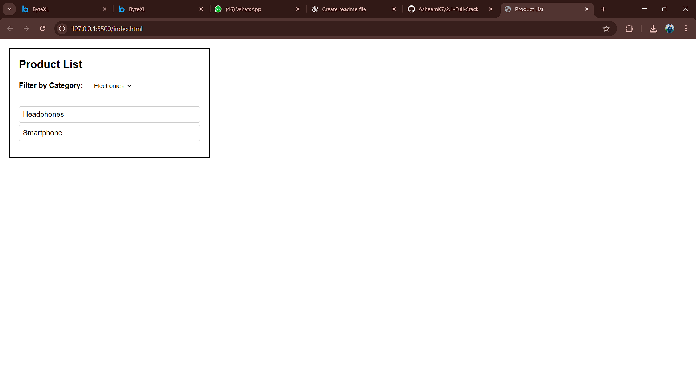

# Product List with Dynamic Filter

## Overview
This project is a simple **web-based product list** where users can filter items by category using a dropdown menu.  
When a category is selected, only products from that category are displayed. If "All" is selected, the full list of products is shown.

---

## Features
- Dropdown menu to filter products by category  
- Dynamic rendering of products using **JavaScript DOM manipulation**  
- Clean and minimal UI with **HTML + CSS**  
- Works in any modern web browser  

---

## Technologies Used
- **HTML5** → Structure of the page  
- **CSS3** → Styling and layout  
- **JavaScript (Vanilla JS)** → Filtering logic and DOM updates  

Made By Asheem Khan 23BCS13395
